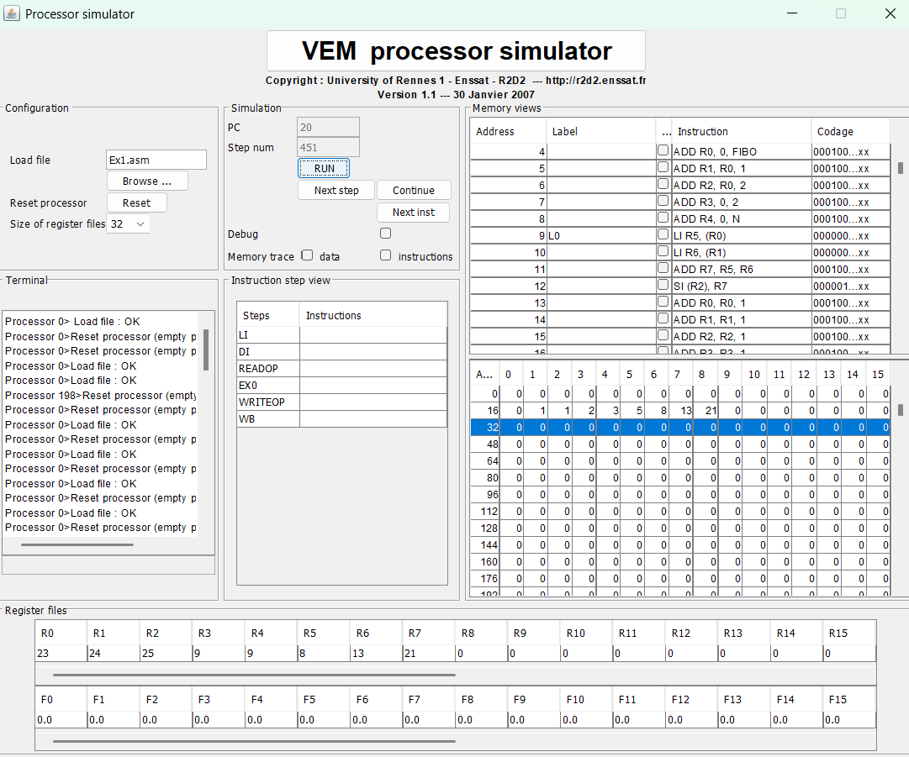

# Ex1-report.md

## Exercise: Fibonacci Sequence (Ex1)

- **File:** `Ex1.asm`
- **Tool:** jSimVEM (VEM Processor Simulator)

---

## 1. Where is the location of input and how to add input to executor?

```asm
.data 16
.global Fibo
    0 1 0 0 0 0 0 0 0 0   -- F(0)=0, F(1)=1, others = 0

.alias N 9    -- Compute up to F(9)
```

- The **input** is the initial values stored under the label `Fibo` in the `.data` section (memory address starting at 16).
- Specifically:
  - Fibo[0] = 0
  - Fibo[1] = 1
  - Other entries initialized as 0.
- The **number of terms to compute (N)** is set using `.alias N 9`.
- ➔ **To change input:**  
  - Modify the numbers after `.global Fibo` (if needed).
  - Modify `.alias N` to change how many Fibonacci numbers to compute.

---

## 2. Where is the location of output and how to interpret output after execution?

- The **output** is also stored in the **same memory block `Fibo`**.
- After the program finishes, the array at `Fibo` contains the full Fibonacci sequence from F(0) to F(N).

**Example output for N=9:**
```
0 1 1 2 3 5 8 13 21 34
```

- **How to check:**  
  - Open the **Memory View** in jSimVEM after program execution.
  - Look at the memory region starting where `Fibo` is located (typically address 16).
  - Each memory slot will have one Fibonacci number.

---

## 3. Explanation about how the input is used and output is produced

- **Registers:**
  - `R0` points to Fibo[i-2]
  - `R1` points to Fibo[i-1]
  - `R2` points to Fibo[i] (current index to store new value)
  - `R3` = loop counter `i` (starts from 2)
  - `R4` = N (the maximum index)
  - `R5`, `R6`, `R7`, `R8` = temporary registers

- **Execution steps:**
  1. Initialize R0, R1, R2 to point to Fibo[0], Fibo[1], Fibo[2].
  2. Start the loop at `i=2`.
  3. Load Fibo[i-2] into `R5`, Fibo[i-1] into `R6`.
  4. Calculate Fibo[i] = Fibo[i-2] + Fibo[i-1], store it at Fibo[i] (through R2).
  5. Move R0, R1, R2 forward (shift the pointers to next elements).
  6. Increment `i` (R3) and compare with `N` (R4).
  7. Repeat until `i == N`.

- **Result:**  
  - After the program ends, Fibo[0] to Fibo[N] hold the computed Fibonacci sequence.

---

## Screenshot



Example idea:  
- Memory starting at address 16 shows `0 1 1 2 3 5 8 13 21 34`.
- Program counter at `.end`.

---

**End of Report**
