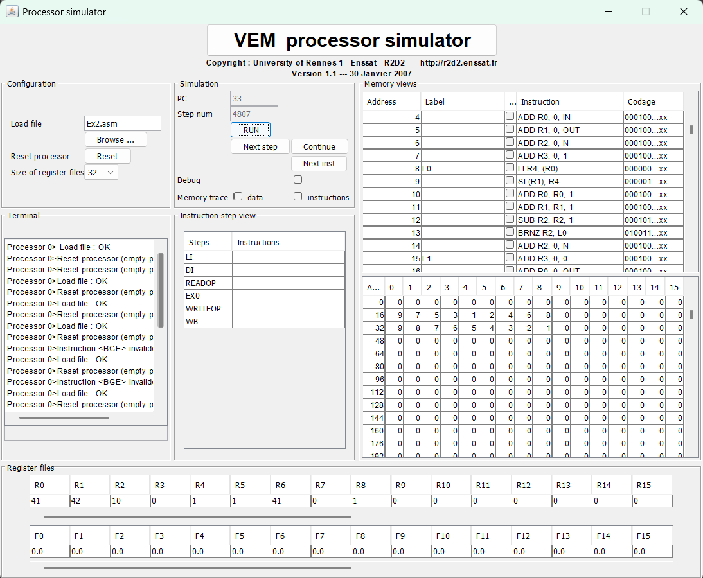

# Ex2-report.md

## Exercise: Bubble Sort (Ex2)

- **File:** `Ex2.asm`
- **Tool:** jSimVEM (VEM Processor Simulator)

---

## 1. Where is the location of input and how to add input to executor?

```asm
.data 16
.global In
    9 7 5 3 1 2 4 6 8 0  -- Input array to be sorted
.alias N 10              -- Number of elements in the array
```

- The **input** is the unsorted array stored under the label `In` in the `.data` section (memory address starting at 16).
- Specifically:
  - `In` contains the unsorted integers that need to be sorted.
  - `N` specifies the number of elements in the array.
- ➔ **To change input:**  
  - Modify the numbers after `.global In` to represent the new unsorted array.
  - Update `.alias N` to match the new size of the array.

---

## 2. Where is the location of output and how to interpret output after execution?

```asm
.data 32
.global Out
    0 0 0 0 0 0 0 0 0 0  -- Output array for sorted numbers
```

- The **output** is stored in the `.data` section under the label `Out` (memory address starting at 32).
- After the program finishes, the array at `Out` contains the sorted integers in ascending order.

**Example output for input `9 7 5 3 1 2 4 6 8 0`:**
```
0 1 2 3 4 5 6 7 8 9
```

- **How to check:**  
  - Open the **Memory View** in jSimVEM after program execution.
  - Look at the memory region starting where `Out` is located (typically address 32).
  - Each memory slot will have one sorted number.

---

## 3. Explanation about how the input is used and output is produced

- **Registers:**
  - `R0` = pointer to the current element in `Out` (used for comparisons).
  - `R1` = pointer to the next element in `Out` (used for comparisons).
  - `R2` = loop counter for the inner loop.
  - `R3` = loop counter for the outer loop.
  - `R4` = temporary register for swapping values.
  - `R5` = swapped flag (1 = true, 0 = false).

- **Execution steps:**
  1. **Copy Input to Output**:
     - The program first copies the unsorted array from `In` to `Out` to preserve the original input.
  2. **Outer Loop**:
     - The outer loop runs until no swaps are made in the inner loop, indicating the array is sorted.
  3. **Inner Loop**:
     - Compares adjacent elements in the `Out` array.
     - If two elements are out of order (`Out[i] > Out[i+1]`), they are swapped, and the `swapped` flag is set.
  4. **Swapping**:
     - The `si` instruction is used to store swapped values back into the `Out` array.
  5. **Termination**:
     - The outer loop terminates when no swaps are made in the inner loop (`swapped = 0`).

- **Result:**  
  - After the program ends, the `Out` array contains the sorted integers in ascending order.

---

## Screenshot




---

**End of Report**